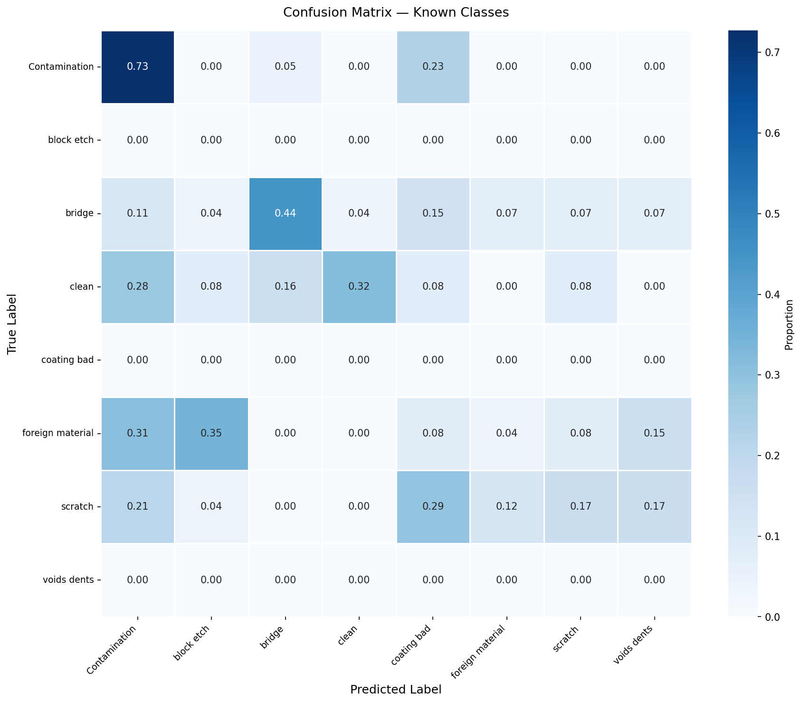
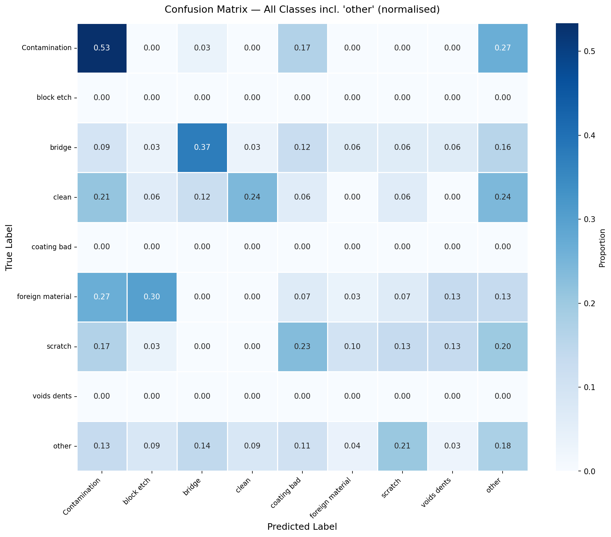
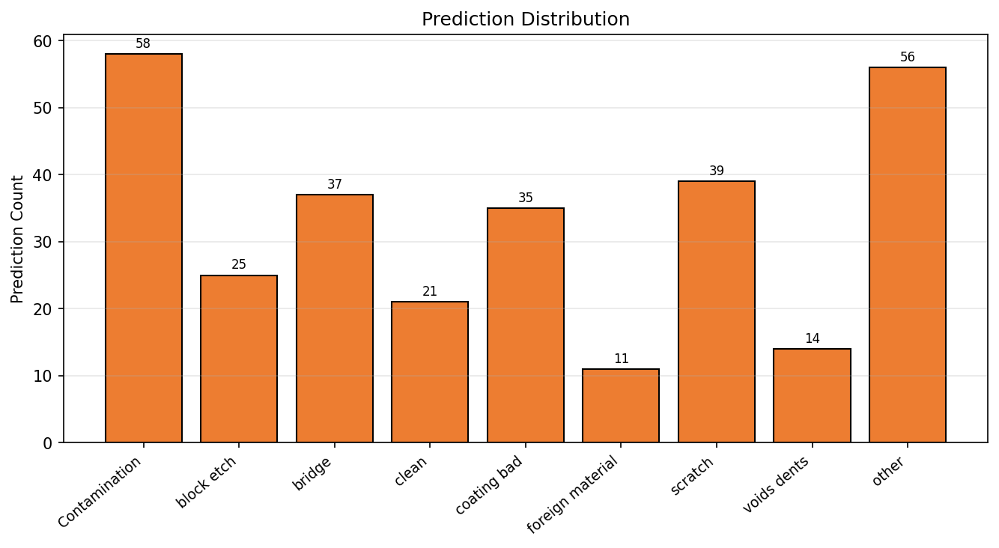

# Forsaken-Apex-Evaluation

Semiconductor defect classification evaluation pipeline for the hackathon test dataset. Built on top of a pre-trained EfficientNet backbone with Squeeze-and-Excitation (SE) blocks, trained using Focal Loss on 8 known defect categories, and evaluated against a 9-class open-set test set containing 4 defect types unseen during training.

---

## Repository Structure

```
Forsaken-Apex-Evaluation/
├── hackathon_test_dataset_prediction.py   # Full evaluation script
├── kaggle-notebook.ipynb                  # Kaggle notebook version
├── Evaluation_log.txt                     # Full evaluation output log
├── confusion_matrix_known_classes.png     # Confusion matrix (known classes only)
├── confusion_matrix_with_other.png        # Confusion matrix (all classes incl. other)
├── prediction_distribution.png            # Prediction count distribution
└── README.md
```

---

## Model Architecture

The model uses an **EfficientNet** backbone augmented with custom **Squeeze-and-Excitation (SE) blocks**, trained end-to-end on grayscale semiconductor wafer images at 224×224 resolution.

- **Loss function**: Focal Loss with label smoothing (`γ=1.5`, `α=0.25`, smoothing=0.1)
- **Input**: Single-channel (grayscale) images, normalised to `[-1, 1]`
- **Output**: 8-class softmax over the known defect categories

### Training Classes

| Index | Class |
|---|---|
| 0 | Contamination |
| 1 | block etch |
| 2 | bridge |
| 3 | clean |
| 4 | coating bad |
| 5 | foreign material |
| 6 | scratch |
| 7 | voids dents |

---

## Evaluation Dataset

The test dataset contains **296 samples across 9 classes**, of which 4 classes were never seen during training:

| Split | Classes | Samples |
|---|---|---|
| Known | Contamination, bridge, clean, foreign material, scratch | 155 |
| Unknown (unseen) | Crack, LER, Open, Other | 141 |

3 training classes — `block etch`, `coating bad`, `voids dents` — have zero samples in the test set and are reported as N/A.

---

## Results

### Classification Report

| Class | Precision | Recall | F1 |
|---|---|---|---|
| Contamination | 0.2759 | 0.5333 | 0.3636 |
| block etch | N/A | N/A | N/A |
| bridge | 0.3243 | 0.3750 | 0.3478 |
| clean | 0.3810 | 0.2424 | 0.2963 |
| coating bad | N/A | N/A | N/A |
| foreign material | 0.0909 | 0.0333 | 0.0488 |
| scratch | 0.1026 | 0.1333 | 0.1159 |
| voids dents | N/A | N/A | N/A |
| other | 0.4464 | 0.1773 | 0.2538 |

### Summary Metrics

| Metric | Value |
|---|---|
| Known-class accuracy | 26.45% |
| Overall accuracy | 22.30% |
| Macro-averaged precision | 27.02% |
| Macro-averaged recall | 24.91% |
| Macro-averaged F1 | 0.2377 |
| Contamination recall | 53.3% |
| Bridge recall | 37.5% |
| Open-set rejections | 56 / 296 (18.9%) |

> **Note on accuracy**: 47.6% of the test set belongs to defect categories unseen during training. Evaluated on the 155 known-class samples only, the model achieves **26.45% accuracy** across 5 active defect types, compared to 20% uniform random chance over 5 classes.

---

## Confusion Matrices

### Known Classes Only


### All Classes including 'other'


### Prediction Distribution


---

## Open-Set Detection

The model was trained exclusively on the 8 known defect classes present in the training dataset. No additional class was introduced into the model architecture or training procedure to represent novel or unseen defect types.

To handle test samples belonging to defect categories outside the training distribution (Crack, LER, Open, Other), we applied a **confidence-based rejection threshold** at inference time. After generating softmax probabilities across the 8 known classes, any prediction where the maximum class confidence fell below a threshold of `0.35` was assigned to an `other` bucket, indicating that the model was not sufficiently confident in any known-class prediction.

```python
if max(softmax_probabilities) < 0.35:
    prediction = "other"
```

This approach requires no architectural changes and adds no learnable parameters. It operates purely as a post-processing step on the model's output probabilities.

### Limitations

This method does not constitute true open-set recognition. The model has no explicit representation of unseen defect types and cannot distinguish between them. A novel defect that visually resembles a known class may still be confidently predicted as that known class and will not be caught by the threshold. In the evaluation set, 141 of 296 samples belonged to unseen classes, of which 56 were correctly rejected and 85 were misclassified as a known defect type.

---

## Running the Evaluation

The evaluation script is designed to run on Kaggle with the model and dataset mounted as input datasets.

```python
# Configure paths in Config class
Config.TEST_DATASET_ROOT = "/kaggle/input/.../hackathon_test_dataset"
Config.MODEL_PATH        = "/kaggle/input/.../final_best.keras"
Config.OUTPUT_DIR        = "/kaggle/working/final_evaluation"

# Run
python hackathon_test_dataset_prediction.py
```

### Dependencies

```
tensorflow >= 2.x
numpy
scikit-learn
matplotlib
seaborn
```

### Output Files

```
final_evaluation/
├── final_evaluation_report.json
├── cm_known_classes.png
├── cm_with_other.png
├── cm_raw_counts.png
├── summary_dashboard.png
└── prediction_distribution.png
```
